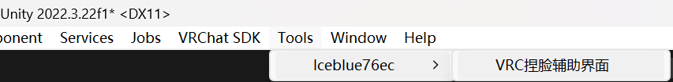
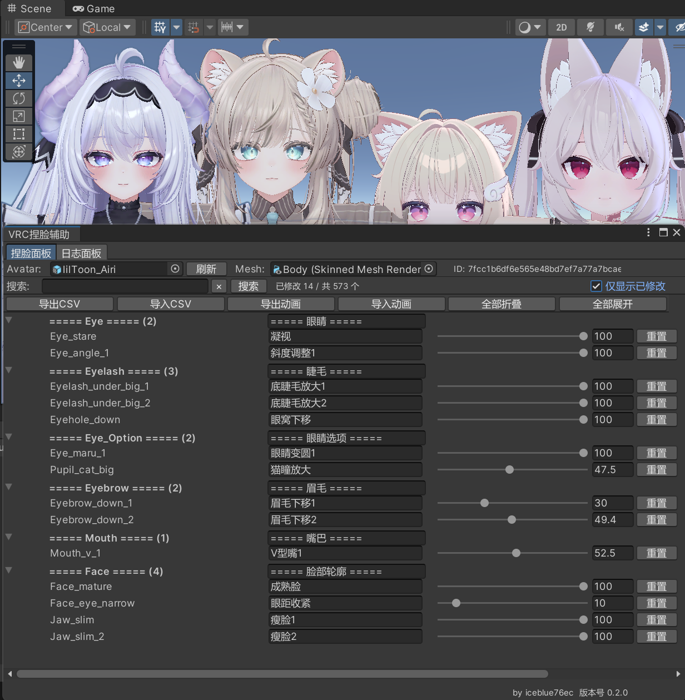

# VRC捏脸辅助小工具

Unity Editor 扩展小工具，帮助 VRChat 玩家在 Unity 中方便地调整 avatar 的 Blender Shape Keys（形态键）。

解决以下痛点:
1.我怎么在500个形态键里快速定位到我要修改的那个？
2.我看不懂形态键的意思，英日混合，罗马音片假名
3.我想把捏脸数据导出成动画保存

## 功能列表

| 功能 | 说明 |
|------|------|
| 自动检测 Avatar | 查找场景中带 VRC Avatar Descriptor 的模型，自动定位 body 对象 |
| 分组折叠 | 自动识别 `=== eye ===`、`*** mouth ***` 等分组标记，支持一键折叠/展开全部，快速定位到你要修改的形态键 |
| 滑块+数值调整 | 每个形态键可拖动滑块或直接输入数值，实时生效 |
| 模糊搜索 | 检索形态键原名、翻译 |
| 形态键名称翻译 | 批量导出形态键到 CSV → 复制给大模型翻译 → 批量导入CSV，支持手动修正 |
| **按模型保存配置** | 用 Mesh GUID 区分不同 avatar，自动加载/复用翻译配置，就算没有配置，也可以通过已有的其它模型同名形态键翻译中进行匹配 |
| 导入导出动画 | 导出 .anim 动画文件进行保存，或从动画导入形态键 |
| 日志面板 | INFO/WARN/ERROR 分级，标签页切换，导出日志 |
| 仅显示已修改 | 只显示已修改的形态键，快速过滤 |

## 使用方式

1. 将 `VRC Facial Editor Helper` 文件夹放入 Unity 项目的 `Assets` 目录
2. 等待 Unity 编译完成
3. 菜单栏 `Tools / Iceblue76ec / VRC捏脸辅助界面` 打开面板





## 形态键翻译配置保存机制

翻译配置按 **Mesh 的 GUID** 分离保存，路径为：

```
Assets/iceblue76ec/configs/{mesh_guid}/translations.json
```

- 同一款模型（相同的原始 body mesh）即使用在不同 avatar 上，也能自动复用翻译
- 首次加载时，会从其他模型已保存配置中匹配**同名形态键**的翻译作为通用翻译
- 删除 `Assets/iceblue76ec` 文件夹即可干净移除所有脚本和配置

## 技术栈

- Unity 2022.3 LTS+
- C# Editor scripting (EditorWindow, MenuItem)
- VRC SDK3 (VRCAvatarDescriptor)

#### 目前自带已完成翻译的模型（欢迎补充）：

- Airi
- manuka
- chiffon
- karin

